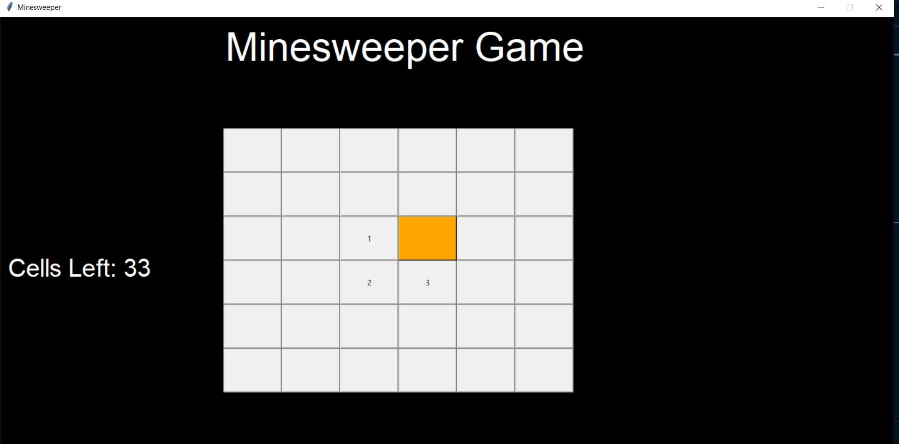

This project is implementing the minesweeper game using python tkinter library.
The project makes use of object oriented programming and some other python libraries like random and ctypes. 

The Game Window:

You Open a cell by left-clicking on it, if it's not a mine it'll show you the number of surrounding cells:

if you suspect that some cell is a mine, you can mark it by a right-click:

if you click on a mine, you lose and get a game over message:
